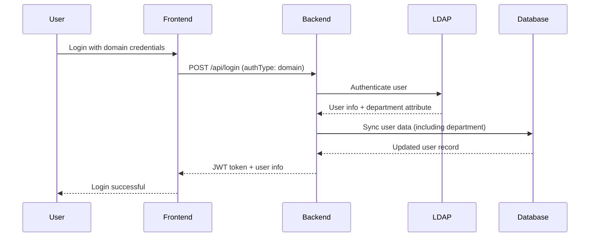

# Department Mapping Guide

## Overview

This guide explains how department information is retrieved, mapped, and stored in the MTI Employee Management System, covering both Active Directory (domain) users and local users.

## Current Implementation

### Department Mapping Logic

1. **Domain Users (AD Authentication)**:
   - Department is retrieved directly from Active Directory `department` attribute
   - Mapped during user authentication and synchronization
   - Stored as-is in local database (no transformation)
   - Updated on each successful domain login

2. **Local Users**:
   - Department is manually assigned during user creation
   - Managed through the user management interface
   - Not synchronized with any external system

### Technical Flow

#### For Domain Users



#### LDAP Service Implementation

**File**: `backend/services/ldapService.js`

```javascript
// AD attributes retrieved during authentication
const searchOptions = {
  scope: 'sub',
  filter: searchFilter,
  attributes: [
    'sAMAccountName',
    'displayName',
    'mail',
    'department',        // ← Department attribute
    'title',
    'telephoneNumber',
    'memberOf',
    'userAccountControl',
    'distinguishedName'
  ]
};

// User info extraction
const userInfo = {
  username: userEntry.sAMAccountName,
  displayName: userEntry.displayName,
  email: userEntry.mail,
  department: userEntry.department,  // ← Direct mapping
  title: userEntry.title,
  phone: userEntry.telephoneNumber,
  groups: Array.isArray(userEntry.memberOf) ? userEntry.memberOf : [userEntry.memberOf].filter(Boolean),
  distinguishedName: userEntry.distinguishedName
};

// Database synchronization
const userData = {
  username: adUser.username,
  name: adUser.displayName || adUser.username,
  role: role,
  department: adUser.department || null,  // ← Stored as-is
  auth_type: 'domain',
  domain_username: adUser.username,
  last_domain_sync: new Date().toISOString()
};
```

## Database Schema

**Table**: `dbo.login`

```sql
CREATE TABLE dbo.login (
    id INT IDENTITY(1,1) PRIMARY KEY,
    username NVARCHAR(100) NOT NULL UNIQUE,
    name NVARCHAR(255),
    password NVARCHAR(255),
    role NVARCHAR(50) DEFAULT 'employee',
    department NVARCHAR(100),           -- ← Department field
    auth_type NVARCHAR(20) DEFAULT 'local',
    domain_username NVARCHAR(100),
    last_domain_sync DATETIME2(3),
    created_at DATETIME2(3) DEFAULT GETDATE(),
    updated_at DATETIME2(3) DEFAULT GETDATE()
);
```

## Current Department Distribution

### Analysis Results (as of 2025-08-08)

- **Total Users**: 10 (9 local, 1 domain)
- **Department Coverage**: 100% - All users have department information
- **Domain Users**: 1 user with department "IT" from AD
- **Local Users**: 9 users with manually assigned departments

### Department Breakdown

| Department | Local Users | Domain Users | Total |
|------------|-------------|--------------|-------|
| IT | 0 | 1 | 1 |
| Human Resources | 3 | 0 | 3 |
| Finance | 1 | 0 | 1 |
| Maintenance | 1 | 0 | 1 |
| Pyrite Plant | 1 | 0 | 1 |
| Acid Plant | 1 | 0 | 1 |
| Chloride Plant | 1 | 0 | 1 |
| Copper Cathode Plant | 1 | 0 | 1 |

## Active Directory Configuration

### Required AD Attributes

1. **Primary Attribute**: `department`
   - Standard AD attribute for organizational department
   - Should be populated for all users requiring department mapping
   - Example values: "IT", "Human Resources", "Finance", "Operations"

### Alternative AD Attributes (if department is not available)

2. **company**: Organization or company name
3. **division**: Business division or unit
4. **physicalDeliveryOfficeName**: Office location
5. **Organizational Unit (OU)**: Extract from Distinguished Name

### AD Schema Example

```ldif
dn: CN=John Doe,OU=IT Department,OU=Employees,DC=mbma,DC=com
sAMAccountName: john.doe
displayName: John Doe
mail: john.doe@mbma.com
department: IT                    # ← Primary department attribute
company: Merdeka Battery Materials
division: Information Technology
physicalDeliveryOfficeName: Jakarta Office
title: Senior Developer
```

## Configuration Options

### Environment Variables

```env
# LDAP Configuration
LDAP_URL=ldaps://10.60.10.56:636
LDAP_BASE_DN=DC=mbma,DC=com
LDAP_BIND_DN=CN=MTI SysAdmin,OU=Testing Environment,OU=Merdeka Tsingshan Indonesia,DC=mbma,DC=com
LDAP_BIND_PASSWORD=Sy54dm1n@#Mb25
LDAP_USER_SEARCH_BASE=DC=mbma,DC=com
LDAP_USER_SEARCH_FILTER=(sAMAccountName={username})
```

### Customizing Department Mapping

To use alternative AD attributes for department mapping, modify the LDAP service:

**File**: `backend/services/ldapService.js`

```javascript
// Option 1: Use 'company' instead of 'department'
department: userEntry.company || null,

// Option 2: Use 'division' instead of 'department'
department: userEntry.division || null,

// Option 3: Use fallback hierarchy
department: userEntry.department || userEntry.division || userEntry.company || null,

// Option 4: Extract from OU structure
department: extractDepartmentFromDN(userEntry.distinguishedName),
```

### OU-Based Department Extraction

```javascript
function extractDepartmentFromDN(distinguishedName) {
  if (!distinguishedName) return null;
  
  const dnParts = distinguishedName.split(',');
  const ouParts = dnParts.filter(part => part.trim().startsWith('OU='));
  
  if (ouParts.length > 0) {
    // Return the first OU (closest to user)
    return ouParts[0].replace('OU=', '').trim();
  }
  
  return null;
}
```

## Troubleshooting

### Common Issues

1. **Department field is empty for domain users**
   - Check if `department` attribute is populated in AD
   - Verify LDAP service account has read permissions
   - Consider using alternative attributes

2. **Department not updating for existing domain users**
   - Department is updated on each successful login
   - Force update by having user log out and log back in
   - Check `last_domain_sync` timestamp in database

3. **Inconsistent department names**
   - Standardize department names in Active Directory
   - Implement department name mapping/transformation
   - Use controlled vocabulary in AD

### Diagnostic Tools

1. **Check Department Data**: `backend/check-department-data.js`
   ```bash
   cd backend
   node check-department-data.js
   ```

2. **Test LDAP Connection**: `backend/test-ldap-connection.js`
   ```bash
   cd backend
   node test-ldap-connection.js
   ```

3. **Department Mapping Test**: `backend/test-department-mapping.js`
   ```bash
   cd backend
   node test-department-mapping.js
   ```

## Best Practices

### For AD Administrators

1. **Populate Department Attribute**: Ensure all users have the `department` attribute set
2. **Consistent Naming**: Use standardized department names across the organization
3. **Regular Audits**: Periodically review and update department information
4. **Documentation**: Maintain a list of valid department names

### For System Administrators

1. **Monitor Sync**: Check `last_domain_sync` timestamps regularly
2. **Error Handling**: Monitor logs for LDAP authentication failures
3. **Backup Strategy**: Ensure department data is included in backups
4. **Testing**: Test department mapping when onboarding new users

### For Developers

1. **Validation**: Implement department name validation if needed
2. **Fallback Logic**: Consider fallback options for missing departments
3. **Logging**: Log department mapping activities for debugging
4. **Performance**: Cache department mappings if needed for large user bases

## Future Enhancements

### Potential Improvements

1. **Department Hierarchy**: Support for sub-departments and organizational structure
2. **Department Mapping Rules**: Configurable rules for transforming AD department names
3. **Multiple Departments**: Support for users belonging to multiple departments
4. **Department Synchronization**: Bulk sync of department information
5. **Department Management UI**: Administrative interface for managing departments

### Implementation Considerations

1. **Database Changes**: May require schema modifications
2. **API Updates**: REST endpoints for department management
3. **UI Components**: Department selection and management interfaces
4. **Migration Scripts**: For existing data transformation
5. **Testing**: Comprehensive testing for new department features

## Conclusion

The current department mapping implementation successfully retrieves department information directly from Active Directory's `department` attribute and stores it in the local database. The system provides 100% department coverage for all users and supports both domain and local authentication methods.

For organizations where the AD `department` attribute is not populated, alternative mapping strategies using other AD attributes or OU structure can be implemented with minimal code changes.